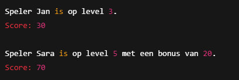

# Scoreboard

Je moet dit kleine projectje gaan afmaken door de kennis van afgelopen lessen te combineren. We hebben een index.php die zo geprogrammeerd moet worden dat de volgende output gegeven wordt:

In de Game folder staan de files van 3 Classes die hiervoor nodig zijn. In elke file staat een stappenplan met wat er in die class moet komen te staan. Begin met het programmeren van die 3 classes. Pas zodra die klaar zijn kun je de output in index.php gaan programmeren. De PDF's met de presentatie staan ook in de hoofdfolder. Daarin kun je de stof van de afgelopen lessen terugvinden.